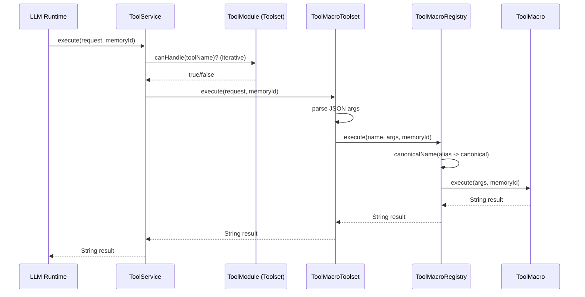

## B. System Diagrams and Architecture Charts

### B.1 Tool Execution Sequence

### B.2 Architecture Notes

- Dispatch layer: service selects module by tool name capability.
- Module layer: each toolset groups related operations.
- Macro layer: single-responsibility command objects execute tool behavior.
- Persistence layer: read-context observations are cached for later tool calls.

### B.3 Frontend Workspace Snapshot

- Main UI screenshot: `docs/screenshots/main-workspace.png`
